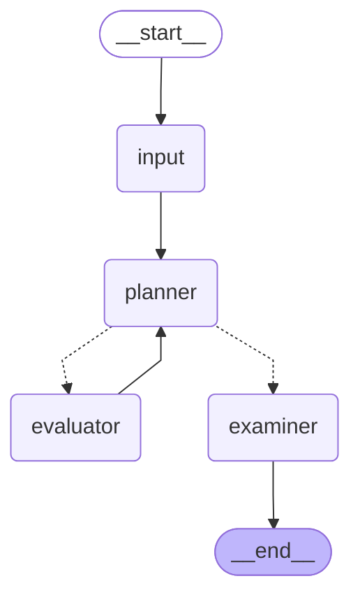

# Planning Agent

[简体中文](./README_zh.md)

## Project Overview

**Planning-Agent** is an intelligent learning assistant system built with **FastAPI**. It provides personalized learning planning based on user profiles. Core features include:

- Collecting basic user information (`user_portrait`)
- Receiving user learning prompts (`prompt`)
- Generating **personalized** study paths, including:
  - Learning goals (`learning_goal`)
  - Detailed learning plans (`learning_plan`)
  - Custom test questions (`exam_questions`)

## Agent Graph


## Environment Setup

### Backend

To clone the entire repository including submodules, run:

```bash
git clone --recursive https://github.com/Blattvorhang/Planning-Agent.git
```

If you've already cloned the repo without `--recursive`, initialize the submodules manually:

```bash
git submodule update --init --recursive
```

Install the required Python packages:

```bash
pip install -r requirements.txt
uv pip install -e "./graph/tools/arxiv-mcp-server/[test]"
```

Then, configure your LLM API key in the `.env` file. Use [`.env.example`](./.env.example) as a reference.

### Frontend

Install dependencies by running:

```bash
cd frontend
npm install
```

## Running the Project

Currently, the project supports local deployment only. Backend runs at `localhost:8000`, and the frontend is available at `localhost:3000`.

### Start the Backend

You can launch the FastAPI backend using either of the following commands:

```bash
uvicorn main:app --reload
# or
python main.py
```

### Start the Frontend

Run:

```bash
cd frontend && npm run dev
```

## API Reference

### Learning Plan Endpoint

- **Endpoint:** `POST /api/learn`
- **Request Body:**

  ```json
  {
    "prompt": "Description of the learning goal"
  }
  ```

- **Response:**

  ```json
  {
    "learning_goal": "Generated learning goal",
    "answer": "Learning plan",
    "exam_questions": "Test questions"
  }
  ```

## Project Structure

```bash
Planning-Agent/
├── LICENSE
├── README.md
├── README_zh.md
├── app
│   ├── README.md
│   ├── __init__.py
│   ├── api.py         # FastAPI route definitions
│   ├── deps.py        # Dependency injection
│   ├── models.py      # Data models
│   ├── question.py    # Data structure for questions
│   └── service.py     # Core service logic
├── assets
│   └── demo.mp4
├── chatbot
├── frontend
├── graph
│   ├── agents
│   ├── tools          # Tool integrations
│   └── workflow
├── main.py            # Entry point for the FastAPI app
└── requirements.txt   # Dependency requirements
```

## Extended Features

This project integrates with the `arxiv-mcp-server` tool, enabling:

- Academic paper search  
- Paper content downloads  
- Research material analysis  

For detailed usage, refer to `tools/arxiv-mcp-server/README.md`.
